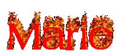

<!--<h1 align="center"> Marie / Bertrahm </h1>-->

    
    
      
      

 rust and pascal programmer, also really interested in demos and esolangs.  
Running arch on a Thinkpad P52. 

---

      
    

---

  
  

<h6 align="center">
    <em> ich nutze arsch bei dem weg </em>
</h6>

<!-- want to add more but cant think of shit -->
